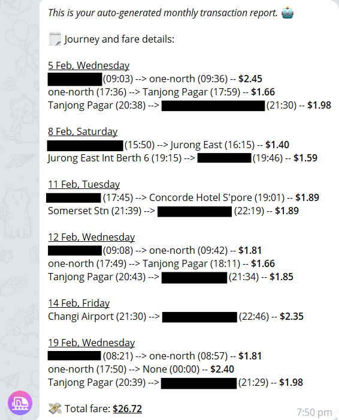

# simplygo-telegram

This repo contains some code I wrote that uses a Telegram bot to automatically send myself my daily and monthly public transportation transaction history.

Here is an example message from the bot:
 

Technologies used:

-   Python
-   AWS (Lambda, IAM, EventBridge, Systems Manager)
-   Terraform

## References

-   [Telegram Bot API docs](https://core.telegram.org/bots/api)
-   [SimplyGoPy](https://github.com/TheDJVG/SimplyGoPy) - thanks to [TheDJVG](https://github.com/TheDJVG) for creating this package.
